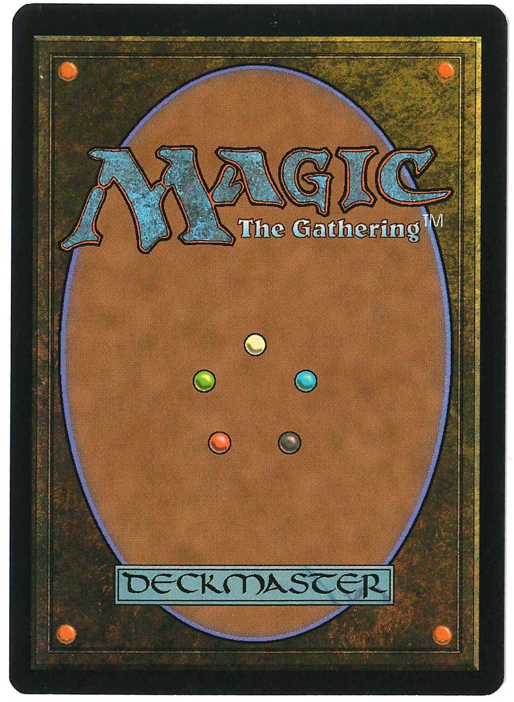

## Magic: The Gathering 紹介

2019/01/19 齋藤 昂也

---

## 自己紹介

- 齋藤 昂也（さいとう たかや）
- Twitter： @SubaruG
- Blog： https://gintenlabo.hatenablog.com/
- 言語： C++, Haskell, PHP, Javascript
- 趣味： ピアノ, Magic: The Gathering

>>>

## 自己紹介（M:tG編）

- 2012年5月にM:tGを始める（ちょっと触っただけ）
- 2014年9月に本格的に参入
- The Last Sun 2017 出場
- グランプリ静岡2018（レガシー） 10勝4敗1分

---

## Magic: The Gathering とは

- 世界初のTCG（1993年8月〜）
- 世界で最も遊ばれているTCG（日本国内だと遊戯王とデュエマが強い）
- プレイヤーはプレインズウォーカー（様々な次元を渡り歩く魔法使い）となり、他のプレインズウォーカーと対決する
- （基本的には）相手のライフを先にゼロにしたほうが勝ち

---

## 世界観

- 様々な次元（Plane）が集まって出来た多元宇宙（Multiverse）が舞台
- 次元ごとに雰囲気が全く違う（丸ごと都市に覆われた次元・ラヴニカや大地が動く冒険の次元・ゼンディカーなど）
- 魔法の原動力であるマナの存在は共通している
- マナには色があり、原則として白、青、黒、赤、緑の五色に分類される（無色もある）

---

## 色について

- 白： 秩序を通して平和を求める色
- 青： 知識を通して完璧を目指す色
- 黒： あらゆる手を尽くして力を求める色
- 赤： 行動を通して自由を求める色
- 緑： 知恵を通して受容を求める色

---

## 白

- 秩序を通じて平和を求める色
- 共同体の重要性を認めている緑と、法の重要性を認めている青が友好色
- 道徳を軽視する黒と、衝動的で制御できない赤が対抗色

>>>

## 白（ゲーム上の特徴）

- 小型クリーチャーの扱いに長ける
- 単体除去はあまり得意ではないが、破壊によらない無力化や、攻撃してきた相手に対する報復などは得意
- 敵味方平等に戦場をリセットする全体除去は得意
- ルールを定めて相手の行動を制限することも得意

---

## 青

- 知識を通して完璧を目指す色
- 計画性のある白と、実用主義の黒が友好色
- 感情的で長期性のない赤と、変化を求めない緑が対抗色

>>>

## 青（ゲーム上の特徴）

- カウンター（相手の行動の妨害）が得意
- カードを引くことが得意
- 破壊は全体的に苦手、一時しのぎしか出来ない
- クリーチャーが全体的に弱い（ただし時々めちゃ強いやつが出る）

---

## 黒

- あらゆる手を尽くして力を求める色
- 策略を好む青と、自分に正直な赤が友好色
- 決定論的な考えを持つ緑と、道徳の名のもとに黒を排除しようとする白が対抗色

>>>

## 黒（ゲーム上の特徴）

- 直接的な破壊や生け贄に捧げさせる等、クリーチャーの除去が得意
- ライフやクリーチャーといったリソースと引き換えに更なる利益を得るのも得意
- 手札破壊によって相手が行動を起こす前に脅威を排除することも得意

---

## 赤

- 行動を通して自由を求める色
- 利己的な黒と、本能を受け入れている緑が友好色
- 個人の自由を抑圧する白と、感情の重要性を理解しない青が対抗色

>>>

## 赤（ゲーム上の特徴）

- クリーチャーやプレイヤーに直接ダメージを与えるのが得意
- 相手のクリーチャーを一時的に奪ったりもできる
- カードを捨ててから引いたり、一時的なドロー（時間が経つと使えなくなる）もできる

---

## 緑

- 知恵を通して受容を求める色
- 野生を受け入れている赤と、共同体の重要性を理解している白が友好色
- 本能を矯正しようとする青と、自制心がなく自然を脅かす黒が対抗色

>>>

## 緑（ゲーム上の特徴）

- クリーチャーが全体的に強い
- マナ加速ができる
- クリーチャーや土地を通じて利益を得ることが得意
- クリーチャーを破壊することは苦手だが、それ以外のものを破壊するのは得意

---

## M:tG の始め方

- ティーチングキャラバン（おすすめ！）
- 各店舗の初心者講習会
- プレリリーストーナメントに出る
- Magic: The Gathering Arena で遊ぶ

---

## ティーチングキャラバン

- M:tG を教えるプロが、初心者に分かりやすく説明
- 参加費は無料で、シンプルなデッキが貰える
- 開催場所と時間を調べるのが少々面倒

---

## 初心者講習会

- 店舗ごとに開催されているティーチングキャラバンのようなもの
- スケジュールが定まっていて参加しやすい（ことが多い）
- 参加費は無料のところが多い

---

## プレリリーストーナメント

- 新セットのカードを使って遊ぶお祭り
- その場でデッキを組むので、自分のデッキを持っていく必要はなし
- カジュアルな雰囲気なので初心者でも気兼ねなく楽しめる
- ルールなどは自分で調べておく必要あり
- 直近だと 1/19,20 に開催されている

---

## Magic: The Gathering Arena

- Windows 向けのアプリ
- チュートリアルがしっかりしている
- 面倒なことは自動で処理してくれるので楽
- 現在 日本語はサポートされていない

---

## 遊び方（フォーマット）

- 主として構築とリミテッドに分けられる
- 構築は自分のデッキを持ち寄って遊ぶ
- リミテッドはその場でパックを開けてデッキを組んで遊ぶ

---

## スタンダード

- ごく最近に発売されたエキスパンションのみ使用できる
- 一年に一回、ローテーション（昔のカードが使えなくなること）が発生
- カードプールが狭い＝覚えるべきことが少ないため、新規参入が容易
- 一方で、競技要素の高い、ガチ目のフォーマットでもある

---

## モダン

- ある程度 新しめ（2003年7月〜）のカードが使用できる
- ローテーションは無い
- 禁止カードでバランスを取っているため、禁止カードが多い
- いろんなデッキが存在している
- そこそこ初期投資が必要だが、長く楽しめる

---

## レガシー

- 禁止されていない限り、発売された殆ど全てのカードが使用できる
- ローテーションは無い
- 禁止カードは存在するが、モダンより禁止基準はゆるい
- 過去の強力カードが使えるのが魅力
- 参入費用が高い。 数十万は覚悟する必要あり

---

## ヴィンテージ

- 発売された殆ど全てのカードが使用できる
- 禁止カードは本当に一部で、どんな壊れたカードでも1枚なら使用できる
- ローテーションは無い
- 数百万くらいかかるのが難点

---

## シールド

- ここからリミテッド
- パックを6つ開けて、出てきたカード＋基本土地のみで40枚以上のデッキを組む
- 運要素が大きいので、初心者でも強いカードを引ければ勝てるのが魅力
- 予算は（最新エキスパンションのパックを使うなら） 一人あたり2000円くらい

---

## ブースタードラフト

- パックを開けて、その中からカードを1枚選んでピック→残りは隣の人に流す、その後 流れてきたカードからカードを1枚選んでピック→残りは隣の人に流す、を3パック繰り返し、ピックしたカード＋基本土地のみで40枚以上のデッキを組む
- シールドより戦略性が高い
- 参加者がたくさん必要（理想は8人、最低でも4人）
- 予算は（最新エキスパンションのパックを使うなら） 一人あたり1000円くらい

---

## その他

- 統率者戦（EDH）
- パックウォーズ
- ブースターブリッツ

---

## まとめ

- 高い戦略性、豊富なカード、濃厚な世界観が魅力のカードゲーム
- 最新エキスパンション「ラヴニカの献身」が 1/25 に発売
- みんなも M:tG 、しよう！
